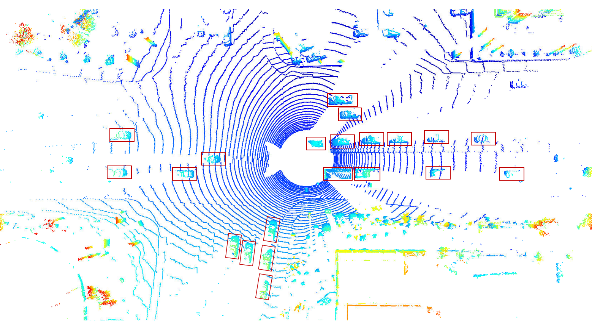
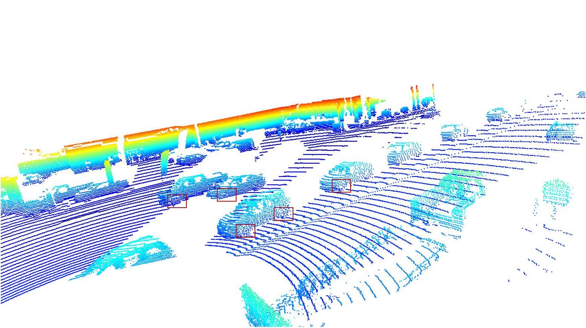
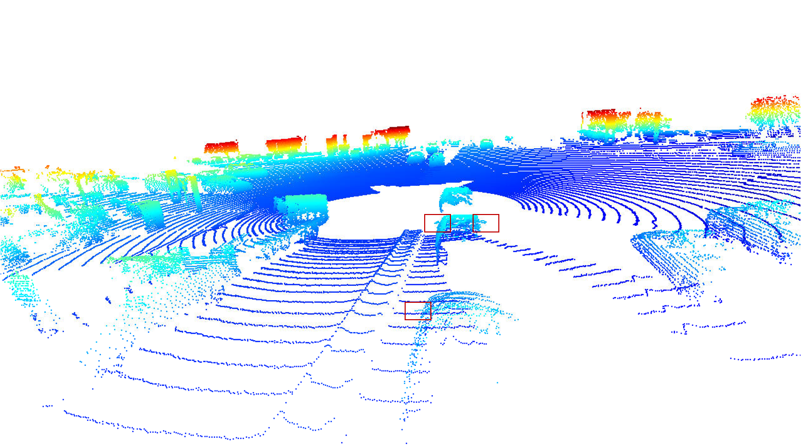
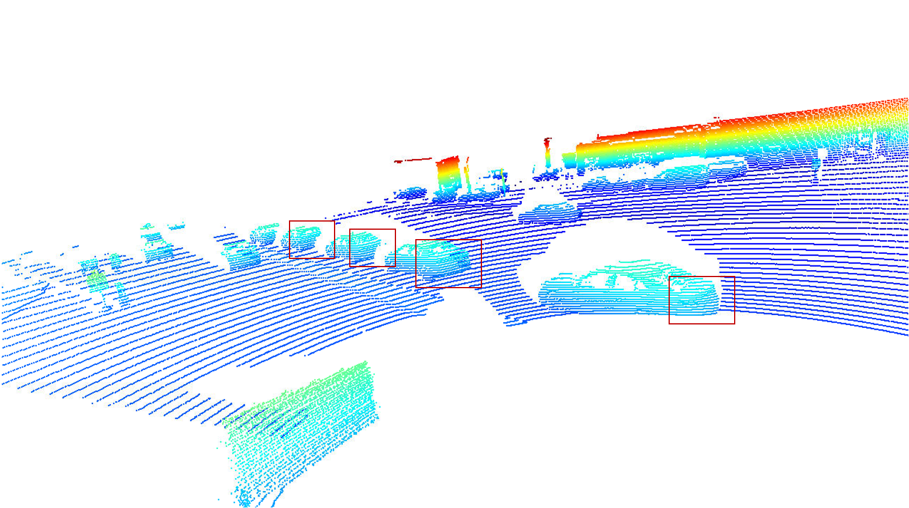
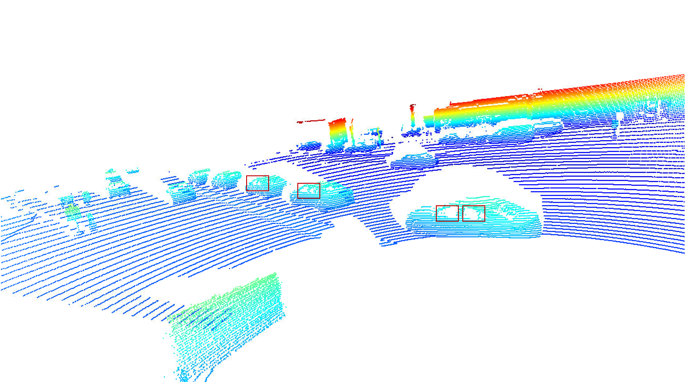
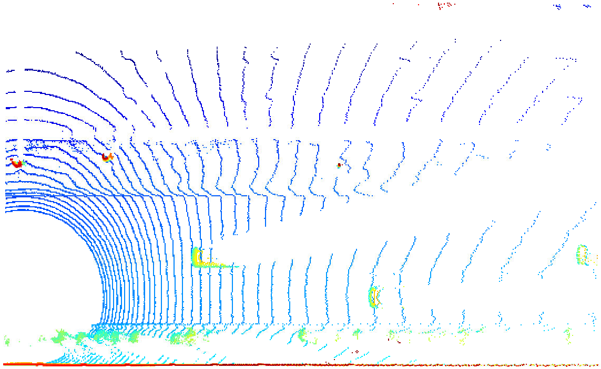
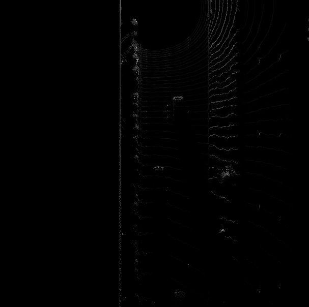

# Mid-Term Project: 3D Object Detection

This is the mid-term project of the section "Sensor Fusion and Tracking" in [Udacity's Nanodegree Program "Self Driving Car Engineer"](https://www.udacity.com/course/self-driving-car-engineer-nanodegree--nd0013).

## 1. Compute Lidar Point-Cloud from Range Image
### 1.1. Visualize Range Image Channels (ID_S1_EX1)

Function 'show_range_image' has been implemented in [objdet_pcl.py](student/objdet_pcl.py).  The cropped range and intensity image is shown below:

### 1.2. Visualize Point-Cloud (ID_S1_EX2)

Function 'show_pcl' has been implemented in [objdet_pcl.py](student/objdet_pcl.py).  The bird's-eye view of the point cloud shows at least 10 examples of vehicles with varying degree of visibility:

A few vehicles features, which appear stable in most of the inspected examples, can be identified:

1. Tires

2. Side mirrors

3. Rear bumpers

4. Wind shields (by the rest of the body)

5. Side windows (by the rest of the body)

Overall, the car body is well represented while windows are not directly visible (only by the rest of the body).  This is consistent with the lidar intensity channel (see e.g. section 1.1), i.e., the body corresponds to a high intensity, while windows have a very low intensity.

## 2. Create Bird's-Eye View from Lidar PCL
### 2.1 Convert Sensor Coordinates to BEV-Map Coordinates (ID_S2_EX1)

The first part of the function 'bev_from_pcl' has been implemented in [objdet_pcl.py](student/objdet_pcl.py).  The resulting BEV-map is shown hereafter:

### 2.2 Compute Intensity Layer of BEV-Map (ID_S2_EX2)

The second part of the function 'bev_from_pcl' has been implemented in [objdet_pcl.py](student/objdet_pcl.py).  A cutout of the resulting intensity layer of the BEV-map is shown below:

### 2.3 Compute Height Layer of BEV-Map (ID_S2_EX3)

## 3. Model-based Object Detection in BEV Image
### 3.1 Add a Second Model from a GitHub Repo (ID_S3_EX1)
### 3.2 Extract 3D Bounding Boxes from Model Response (ID_S3_EX2)

## 4. Performance Evaluation for Object Detection
### 4.1 Compute Intersection-over-Union (IOU) between labels and detections (ID_S4_EX1)
### 4.2 Compute False-Negatives and False-Positives (ID_S4_EX2)
### 4.3 Compute Precision and Recall (ID_S4_EX3)
