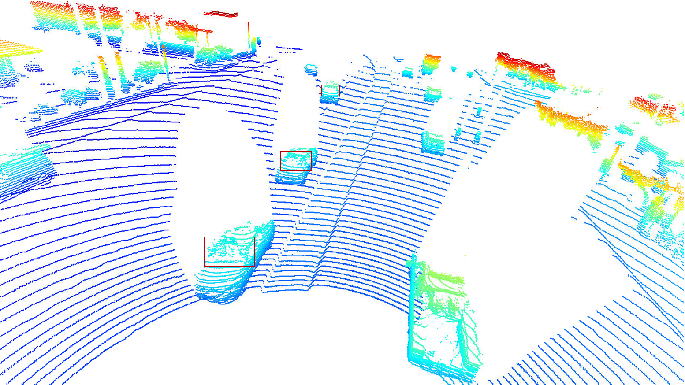
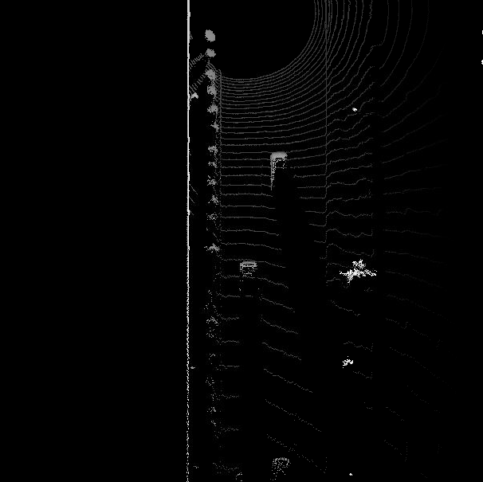
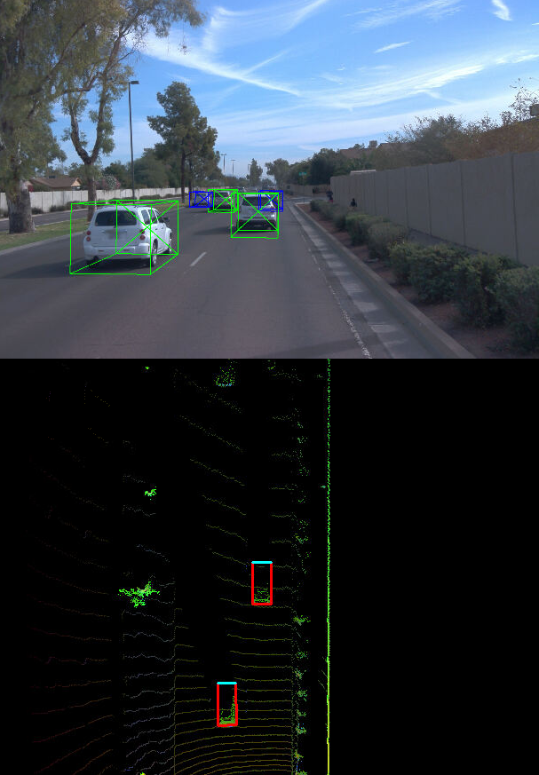
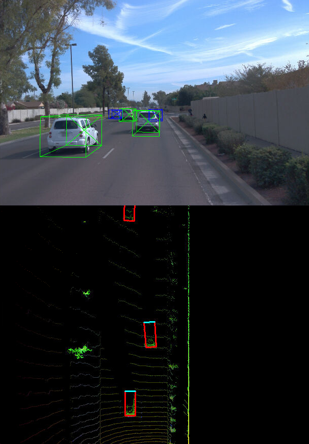
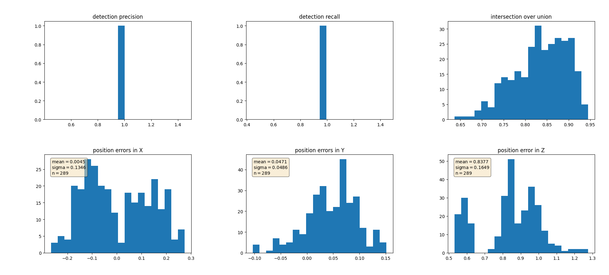

# Mid-Term Project: 3D Object Detection

This is the mid-term project of the section "Sensor Fusion and Tracking" in [Udacity's Nanodegree Program "Self Driving Car Engineer"](https://www.udacity.com/course/self-driving-car-engineer-nanodegree--nd0013).

## 1. Compute Lidar Point-Cloud from Range Image
### 1.1. Visualize Range Image Channels (ID_S1_EX1)

Function 'show_range_image' has been implemented in [objdet_pcl.py](student/objdet_pcl.py).  The cropped range and intensity image is shown below:

### 1.2. Visualize Point-Cloud (ID_S1_EX2)

Function 'show_pcl' has been implemented in [objdet_pcl.py](student/objdet_pcl.py).  The bird's-eye view of the point cloud shows at least 10 examples of vehicles with varying degree of visibility:

A few vehicles features, which appear stable in most of the inspected examples, can be identified:

1. Tires

2. Side mirrors

3. Rear bumpers

4. Wind shields (by the rest of the body)

5. Side windows (by the rest of the body)

Overall, the car body is well represented while windows are not directly visible (only by the rest of the body).  This is consistent with the lidar intensity channel (see e.g. section 1.1), i.e., the body corresponds to a high intensity, while windows have a very low intensity.

## 2. Create Bird's-Eye View from Lidar PCL
### 2.1 Convert Sensor Coordinates to BEV-Map Coordinates (ID_S2_EX1)

The first part of the function 'bev_from_pcl' has been implemented in [objdet_pcl.py](student/objdet_pcl.py).  The resulting BEV-map is shown hereafter:

### 2.2 Compute Intensity Layer of BEV-Map (ID_S2_EX2)

The second part of the function 'bev_from_pcl' has been implemented in [objdet_pcl.py](student/objdet_pcl.py).  The resulting intensity layer of the BEV-map is shown below:

### 2.3 Compute Height Layer of BEV-Map (ID_S2_EX3)

The third part of the function 'bev_from_pcl' has been implemented in [objdet_pcl.py](student/objdet_pcl.py).  The resulting height layer of the BEV-map is shown below:

## 3. Model-based Object Detection in BEV Image
### 3.1 Add a Second Model from a GitHub Repo (ID_S3_EX1)

1. The configuration parameters from [SFA3D](https://github.com/maudzung/SFA3D/tree/master) were added to the function 'load_configs_model' in [objdet_detect.py](student/objdet_detect.py).
2. The model instantiation was added to the function 'create_model' in [objdet_detect.py](student/objdet_detect.py).

### 3.2 Extract 3D Bounding Boxes from Model Response (ID_S3_EX2)

1. The model output decoding was added to the function 'detect_objects' in [objdet_detect.py](student/objdet_detect.py).
2. The extraction of boundary boxes was added to the function 'detect_objects' in [objdet_detect.py](student/objdet_detect.py).

The following figures show the ground truth at the top and the prediction based on lidar at the bottom for frames 50 and 51.  One should notice that lidar data only becomes sufficient in frame 51 to detect the 3rd car:

  
  

## 4. Performance Evaluation for Object Detection
### 4.1 Compute Intersection-over-Union (IOU) between labels and detections (ID_S4_EX1)

The first part of the function 'measure_detection_performance' has been implemented in [objdet_eval.py](student/objdet_eval.py).

### 4.2 Compute False-Negatives and False-Positives (ID_S4_EX2)

The second part of the function 'measure_detection_performance' has been implemented in [objdet_eval.py](student/objdet_eval.py).

### 4.3 Compute Precision and Recall (ID_S4_EX3)

The computation of precision and recall has been implemented in the function 'compute_performance_stats' in [objdet_eval.py](student/objdet_eval.py).  The results of precision = 0.95 and recall = 0.94 were obtained with the following distributions:

The position error in the horizontal plane is relatively small, i.e. below 10 cm.  Hence, LiDAR is a rather effective way for object detection.

The application of the 'fpn_reset' method results in precision = 0.98 and recall = 0.88.  Hence 'fpn_resnet' has a higher probability of a detected car actually being a real car than 'darknet', but a lower probability for finding a real car.
